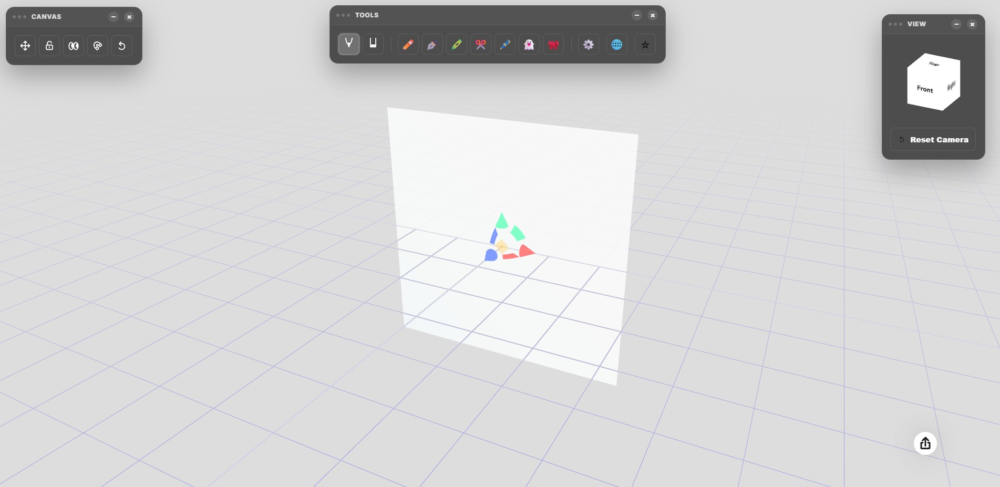

# 🖌️ XocoPenzil - Dibujo 3D sobre Superficies

[Xocopenzil aplicación ](https://xocostudio.github.io/Penzil-Pro-/)   

Penzil es una herramienta de dibujo 3D intuitiva y potente que te permite crear bocetos artísticos directamente sobre superficies tridimensionales. Diseñada para artistas, diseñadores y entusiastas del 3D, combina la libertad del dibujo a mano alzada con la precisión del espacio tridimensional.

## 🚀 ¿Qué hace Penzil?

Penzil permite "proyectar" tus trazos sobre un lienzo (Canvas) 3D que puedes mover, escalar y rotar. A diferencia del dibujo tradicional, en Penzil puedes:

*   **Dibujar en 3D:** Tus trazos se adhieren a la superficie de objetos (planos, cubos, esferas o incluso modelos personalizados).
*   **Simetría Avanzada:** Crea diseños complejos con simetría en múltiples ejes (X, Y, Z) o simetría radial.
*   **Pinceles Personalizables:** Ajusta el grosor, color, opacidad, suavizado y efectos de vibración (wiggle).
*   **Gestión de Capas:** Organiza tu dibujo en diferentes capas, permitiéndote ocultar o bloquear partes de tu trabajo.
*   **Exportación:** Guarda tus creaciones para utilizarlas en otros programas como Blender o Procreate.

## 🛠️ Herramientas Principales

1.  **Canvas:** Tu superficie de dibujo. Puedes cambiar su forma y manipularla en el espacio.
2.  **Tools (Herramientas):** Selecciona entre modo Dibujo o Borrador y elige entre diferentes preajustes de pincel (Lápiz, Bolígrafo, Marcador, etc.).
3.  **Properties (Propiedades):** Ajusta los parámetros técnicos de tu trazo:
    *   **Taper (Afilado):** Controla la terminación en punta de las líneas.
    *   **Smooth (Suavizado):** Elimina el temblor de la mano para trazos fluidos.
    *   **Wiggle (Vibración):** Añade un aspecto de boceto rugoso o tembloroso de forma artística.
    *   **Tex Scale:** Ajusta la escala de la textura o el patrón de la línea.
4.  **View (Vista):** Un cubo de navegación para cambiar rápidamente la perspectiva de la cámara.

## ⌨️ Teclas Rápidas (Shortcuts)

Para un flujo de trabajo rápido, Penzil incluye los siguientes atajos de teclado:

| Tecla | Acción |
| :--- | :--- |
| **Espacio (Mantener)** | Mueve la cámara (Truck/Pan) en lugar de rotarla. |
| **Espacio (Pulsar)** | Oculta/Muestra el Canvas de dibujo rápidamente. |
| **Alt Izquierdo** | Modo de rotación de cámara (activado por defecto para el ratón). |
| **Alt Gr** | Oculta/Muestra TODA la interfaz de usuario (Modo Zen). |
| **Delete / Backspace** | Elimina el objeto seleccionado actualmente. |
| **Z (con Ctrl)** | Deshacer (Undo). |
| **Y (con Ctrl)** | Rehacer (Redo). |

## 🖱️ Control de Cámara

*   **Click Izquierdo / Un dedo:** Rotar la cámara alrededor del objetivo.
*   **Click Derecho o Espacio + Click Izquierdo:** Mover la cámara lateralmente (Pan).
*   **Rueda del ratón / Pellizcar:** Zoom in / Zoom out.
*   **Doble click en el cubo de Vista:** Resetea la cámara a la cara del cubo seleccionada.

---
*Desarrollado para la creatividad en 3D.*

## Descargo de Responsabilidad

**Importante:** El uso de este código es bajo total responsabilidad del usuario. ** Xocostudio** no se hace responsable por ningún tipo de mal uso, daño directo o indirecto, pérdida de datos, o cualquier otro perjuicio que pueda derivarse del uso de este software.

### Sin Garantías

El software se proporciona "tal cual", sin garantías de ningún tipo, ya sean expresas o implícitas. Esto incluye, pero no se limita a, las garantías de comerciabilidad, adecuación para un propósito particular y no infracción.

### Exención de Responsabilidad

Los autores no son responsables por cualquier reclamación, daño u otra responsabilidad que surja del uso del software, ya sea en una acción de contrato, agravio o de otra manera, que surja de, fuera de o en conexión con el software o el uso u otros tratos en el software.

### Uso del Código

Al descargar y utilizar este código, aceptas hacerlo bajo tu propio riesgo. Es tu responsabilidad asegurarte de que el software es adecuado para tus necesidades y de tomar todas las precauciones necesarias para evitar posibles daños o pérdidas.

Si tienes alguna pregunta o necesitas más información, por favor contacta a Xocostudio.

---

*¡Gracias por utilizar nuestro software! Asegúrate de leer y entender este descargo de responsabilidad antes de proceder.*
